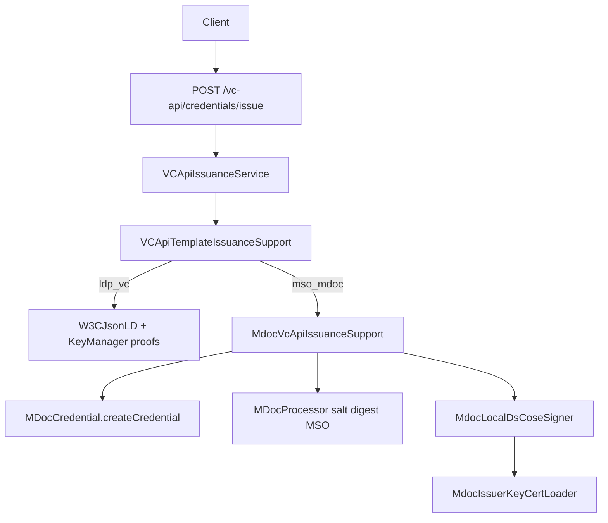

# VC API mDoc / mDL Support

Design and implementation notes for native `mso_mdoc` issuance on the W3C VC API path in Inji Certify — **without** the VCI plugin.

---

## 1. Purpose

| Item | Description |
|------|-------------|
| **API** | `POST /v1/certify/vc-api/credentials/issue` |
| **Formats** | `ldp_vc` (existing) and `mso_mdoc` (this work) |
| **Auth** | API key (`X-API-Key`) |
| **Signing (mdoc)** | Local Document Signer from config property (not KeyManager / not plugin) |

Format is selected from the onboarded credential configuration’s `credentialFormat`. Clients do not send a separate format field.

---

## 2. Request / response

### Request (same shape for both formats)

```json
{
  "credentialSubject": {
    "id": "did:jwk:...",
    "family_name": "Doe",
    "given_name": "Jane"
  },
  "options": {
    "credentialConfigurationId": "mdl-config-id"
  }
}
```

For mdoc, `credentialSubject` is the **claims bag** matching Velocity placeholders in the onboarded `vcTemplate`. The holder device key should be supplied as `id` (`did:jwk:...`) when the MSO requires `deviceKeyInfo`.

### Response — `ldp_vc`

```json
{
  "format": "ldp_vc",
  "verifiableCredential": { "@context": ["..."], "type": ["..."], "proof": { } }
}
```

### Response — `mso_mdoc`

```json
{
  "format": "mso_mdoc",
  "verifiableCredential": "<base64url-encoded-cbor-IssuerSigned-mdoc>"
}
```

---

## 3. Document Signer configuration

```properties
# Preferred (Certify-native)
mosip.certify.mdoc.issuer-key-cert=${mosip.certify.mock.mdoc.issuer-key-cert:}

# Existing mock / docker-compose value (also used as fallback)
mosip.certify.mock.mdoc.issuer-key-cert=<base64PrivateKey>||<base64Certificate>
```

| Part | Encoding |
|------|----------|
| Private key | Base64 of PKCS#8 DER (EC P-256) |
| Certificate | Base64 of X.509 DER or PEM bytes |
| Separator | `\|\|` |

Generate material with [`deploy/inji-certify/mdoc.sh`](../deploy/inji-certify/mdoc.sh).

Loader: `MdocIssuerKeyCertLoader` — reads preferred property first, then mock fallback. Empty value when issuing mdoc → `mdoc_ds_key_not_configured`.

---

## 4. Architecture



### Classes

| Class | Role |
|-------|------|
| `VCApiTemplateIssuanceSupport` | Branches on `credentialFormat` |
| `MdocVcApiIssuanceSupport` | Template params, create unsigned mdoc, local DS sign, base64url |
| `MdocIssuerKeyCertLoader` | Parse DS property |
| `MdocLocalDsCoseSigner` | COSE_Sign1 ES256 + unprotected `x5chain` (label 33) |
| `MDocProcessor.signMSOWithLocalDs` | VC API overload (OID4VCI still uses KeyManager `signMSO`) |

### Processing order (mdoc)

1. Validate all non-system `vcTemplate` placeholders are present/non-blank in `credentialSubject`
2. Validate config is `mso_mdoc` with `docType`
3. Resolve template name via `CredentialCacheKeyGenerator`
4. Build template params (claims, `_doctype`, holder id, validity)
5. `MDocCredential.createCredential` (Velocity + `processTemplatedJson`)
6. Salt → digests → MSO
7. Local DS COSE_Sign1
8. IssuerSigned structure → CBOR → base64url
9. Optional ledger metadata (no status-list for mdoc)

---

## 5. Out of scope

- `MdlPkiService` / KeyManager IACA+DS provisioning (future replacement for property DS)
- OID4VCI `/issuance/credential` path (unchanged; still KeyManager COSE)
- VCI plugin (`MDocMockVCIssuancePlugin`)

---

## 6. Errors

| Code | When |
|------|------|
| `missing_mandatory_claim` | `credentialSubject` missing a claim required by `vcTemplate` placeholders |
| `mdoc_ds_key_not_configured` | DS property empty |
| `mdoc_ds_key_invalid` | Bad format / Base64 / key parse |
| `mdoc_local_cose_sign_failed` | COSE signing failure |
| `mdoc_doctype_required` | Config missing `docType` |
| `unsupported_credential_format` | Format other than `ldp_vc` / `mso_mdoc` |
