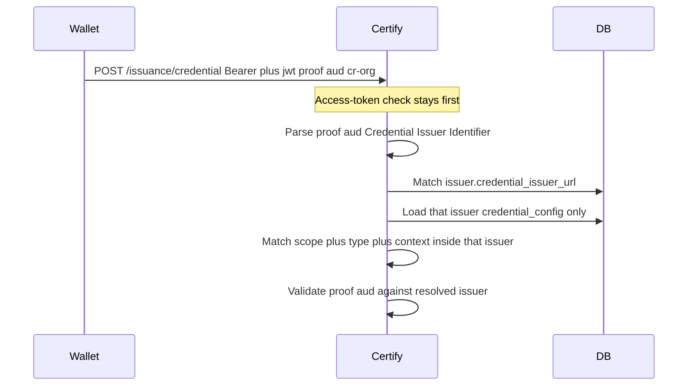

# Issuer resolution from JWT proof `aud`

Tracking note for the Certify-only change that identifies the issuer on the **shared** OpenID4VCI credential endpoint.

**Status:** implemented  
**Wallet / eSignet changes:** none  
**Credential endpoint:** unchanged (`POST …/issuance/credential`)

---

## Problem

Wallets do not send `issuerId` on `POST /issuance/credential`. Many onboarded orgs reuse the same OAuth scope (for example `mock_identity_vc_ldp`).

Certify previously treated **scope as the issuer key**: `findByScopeAndStatus` then picked the **first non-`default` `issuer_id`**. A download started as `cr-org` was processed as whichever issuer was inserted first.

Same scope on **several templates of one issuer** was already fine: after the issuer is chosen, `@context` + `type` pick the template. Same scope on **many issuers** had no second key.

---

## Spec alignment

OpenID4VCI separates two URLs:

| Field | Role | Certify value |
|-------|------|----------------|
| `credential_issuer` | Unique Credential Issuer Identifier. JWT proof `aud` **MUST** be this value. | `issuer.credential_issuer_url` → `{domain}/{issuerId}` (e.g. `…/certify/cr-org`) |
| `credential_endpoint` | Where the wallet POSTs. May be a shared path. | `{domain}/issuance/credential` |

Inji already sets proof `aud` to Mimoto `credential_issuer_host` (the same URL as `credential_issuer`). No wallet or eSignet change is required.

---

## Resolution order

`IssuerResolver.resolve(issuerId, scopeClaim, proof)`:

1. Explicit `credentialRequest.issuerId` if present (internal / admin).
2. Parse JWT proof `aud` (claims only, no signature check). Match an **active** issuer where trimmed `credential_issuer_url` or `identifier` equals trimmed `aud`.
3. If no URL match, take the last path segment of `aud` (e.g. `cr-org`) and load that `issuerId` if it exists and is active.
4. Scope fallback **only when exactly one distinct `issuer_id`** has that active scope (legacy single-issuer / same-org multi-template).
5. If several issuers share the scope and `aud` did not match, do **not** pick the first row. Fall back to `default`.

After resolve, issuance is unchanged: load that issuer’s metadata, map scope + format + type/`@context` (or mdoc/sd-jwt) **inside that issuer**, then `JwtProofValidator` checks `aud` against the resolved issuer.

---

## Files

| File | Change |
|------|--------|
| `certify-service/…/services/IssuerResolver.java` | Proof `aud` first; unique-scope fallback only |
| `certify-service/…/proof/JwtProofAudienceExtractor.java` | Unsigned JWT `aud` parse |
| `certify-service/…/repository/IssuerRepository.java` | `findByCredentialIssuerUrlAndStatus`, `findByIdentifierAndStatus` |
| `certify-service/…/utils/IssuerUrlUtil.java` | `extractLastPathSegment` |
| `certify-service/…/services/VCIssuanceServiceImpl.java` | Pass `credentialRequest.getProof()` |
| `certify-service/…/services/CertifyIssuanceServiceImpl.java` | Pass `credentialRequest.getProof()` |
| `certify-service/src/test/…/IssuerResolverTest.java` | Shared-scope + `aud` → correct issuer |
| `certify-service/src/test/…/JwtProofAudienceExtractorTest.java` | Extractor unit tests |
| `certify-service/src/test/…/IssuerUrlUtilTest.java` | Path-segment cases |

No schema / SQL change. No nginx or credential-endpoint path change.

---

## Out of scope

Empty **401** on `/issuance/credential` is access-token `iss` / `aud` in `AccessTokenValidationFilter`, **before** issuer resolve. Token `aud` is the **credential endpoint**, not `credential_issuer`.

---

## Verify locally

1. Rebuild and restart the Certify image so this code is running.
2. Download a credential from an org that shares `mock_identity_vc_ldp` with others (e.g. `cr-org`).
3. Certify debug log should show `Resolved issuer cr-org from JWT proof aud`, not another org from scope.
4. Same issuer with several templates on the same scope should still issue the template that matches `@context` + `type`.
